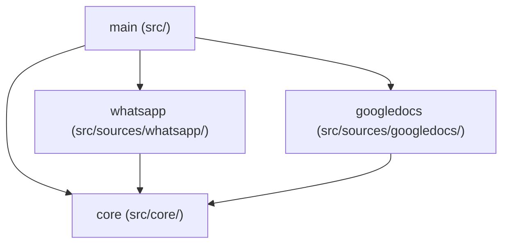

# Source Package Refactor + Config Polling

## Target directory structure

```
src/
  go.mod                     # module mcpyeahyouknowme (unchanged)
  main.go                    # CLI dispatch, runCore(), runMcp()
  daemon.go                  # General daemon mgmt (plist, start/stop/restart, info, completions)
  config.go                  # NEW: Config file loading, saving, polling
  mcp.go                     # MCP server setup + global search tool + shared helpers
  search_store.go            # Cross-source search index
  search_store_init.go
  embedding.go / _init.go    # Embedding support
  fuzzy.go                   # Fuzzy matching (used by WhatsApp service)
  info_cli.go                # Info display (calls into source packages)

  core/                      # NEW package "core" — shared interfaces & types
    interfaces.go            # DataSource (required, includes Reset()), CoreService (required — all sources must sync), SearchEntry, SourceConfig
    helpers.go               # DataDir(), IntArg(), BoolArg(), JsonResult()
    utils.go                 # DefaultReset(), RunPollLoop(), OpenDB() — shared utilities sources call (not embed)

  sources/
    whatsapp/                # NEW package "whatsapp"
      source.go              # Source struct, Name(), Description(), Close(), SearchEntries()
      mcp.go                 # RegisterTools() + tool handler closures
      daemon.go              # StartCore(), RequiresAuth(), handleMessage(), handleHistorySync(), GetChatName(), startRESTServer()
      client.go              # sendWhatsAppMessage(), downloadMedia(), extractTextContent(), extractMediaInfo(), analyzeOggOpus(), types
      cli.go                 # RunLogin(), RunReset(), IsLoggedIn() — exported for main
      store.go               # MessageStore + methods
      store_init.go          # NewMessageStore()
      service.go             # MCPService + all read/write operations + types (MCPMessage, MCPChat, etc.)
      helpers.go             # nullStr(), jidPhone(), parseTime(), looksLikePhoneNumber(), etc.

    googledocs/              # NEW package "googledocs"
      source.go              # Source struct, Name(), Description(), Close(), SearchEntries()
      mcp.go                 # RegisterTools() + handlers (handleSearch, handleGetDocument, handleListRecent)
      daemon.go              # StartCore(), RequiresAuth(), syncDocuments(), extractDocumentText() — change poll from 15min to 5min per datasources rule
      client.go              # getOAuthConfig(), loadToken(), saveToken(), isAuthenticated()
      cli.go                 # RunLogin(), RunReset() — OAuth flow, PKCE, openBrowser()
```

## Import graph (no cycles)




- `main` imports `core`, `sources/whatsapp`, `sources/googledocs`
- Each source imports `core` for shared interfaces
- No source imports the other; no source imports `main`

## File migration map

### From `src/` main package to `src/core/`

- [source.go](src/source.go): `DataSource`, `CoreService` interfaces → `core/interfaces.go` (note: `CoreService` becomes required for all sources, not optional)
- [search_store.go](src/search_store.go): `SearchEntry` struct → `core/interfaces.go`
- [mcp.go](src/mcp.go): `intArg()`, `boolArg()`, `jsonResult()` → `core/helpers.go` (exported)
- [datadir.go](src/datadir.go): `dataDir()` → `core/helpers.go` as `DataDir()` (exported)

### From `src/` main package to `src/sources/whatsapp/`

- [source_whatsapp.go](src/source_whatsapp.go) → split across `source.go` + `mcp.go`
- [whatsapp_core.go](src/whatsapp_core.go) → split across `daemon.go` + `client.go`
- [store.go](src/store.go) + [store_init.go](src/store_init.go) → `store.go` + `store_init.go`
- [mcp_service.go](src/mcp_service.go) → `service.go` + `helpers.go`
- [fuzzy.go](src/fuzzy.go) → `helpers.go` (or keep in main if search also uses it)
- [daemon.go](src/daemon.go) lines 35-57, 59-190, 246-289: `isLoggedIn()`, `runLogin()`, `whatsAppReset()` → `cli.go`
- [info_cli.go](src/info_cli.go): `whatsappInfoLines()` → `cli.go` as `InfoLines()` (exported)

### From `src/` main package to `src/sources/googledocs/`

- [source_googledocs.go](src/source_googledocs.go) → split across `source.go`, `mcp.go`, `daemon.go`, `client.go`
- [daemon_googledocs.go](src/daemon_googledocs.go) → `cli.go`
- [info_cli.go](src/info_cli.go): `googleDocsInfoLines()` → `cli.go` as `InfoLines()` (exported)

### Files that stay in `src/` main package (slimmed down)

- `main.go` — CLI dispatch (calls `whatsapp.RunLogin()`, `googledocs.RunLogin()`, etc.)
- `daemon.go` — plist management, `runStart/Stop/Restart`, `runInfo`, `runCompletions`, `runUninstall`, `runReset` (full reset)
- `mcp.go` — `runMcp()`, `indexSources()`, `registerSearchTool()` (helpers move to core)
- `config.go` — NEW config file system
- `search_store.go` / `search_store_init.go` — unchanged except import `core.SearchEntry`
- `embedding.go` / `embedding_init.go` — unchanged
- `info_cli.go` — `runInfo()` calls `whatsapp.InfoLines()` and `googledocs.InfoLines()`

## Config file system

**Location**: `{DataDir()}/config.json`

**Structure** (in `core/interfaces.go`):

```go
type Config struct {
    Sources map[string]SourceConfig `json:"sources"`
}
type SourceConfig struct {
    Enabled bool            `json:"enabled"`
    Reset   bool            `json:"reset,omitempty"`
    Auth    json.RawMessage `json:"auth,omitempty"`
}
```

- WhatsApp: `enabled` flag only (auth is in whatsapp.db, checked via `IsLoggedIn()`)
- Google Docs: `enabled` + `auth` field holds the OAuth token JSON (replaces `googledocs_token.json`)

**Daemon polling** (in `config.go`):

- `runCore()` starts a goroutine that stats `config.json` every 10 seconds
- On mtime change, reloads config and compares to previous state
- Sources becoming enabled: start their `CoreService` in a new goroutine
- Sources becoming disabled: cancel that source's context

**CLI commands updated**:

- `whatsapp login` → on success, writes `{"whatsapp": {"enabled": true}}` to config (daemon picks up within 10s)
- `googledocs login` → writes `{"googledocs": {"enabled": true, "auth": {token}}}` to config
- No more `launchctl unload/load` in any login/reset command

**Reset flow** (daemon-owned cleanup):

- CLI writes `{"whatsapp": {"reset": true}}` to config and prints "Reset requested. Daemon will clean up within 10 seconds."
- Daemon detects `reset: true` within 10s, cancels the source's context, waits for `StartCore()` to return, calls `source.Reset(dataDir)` to remove data files, then removes that source's entry from config
- Each source implements `Reset(dataDir string)` knowing which files to delete (its own DBs, tokens, etc.)
- Edge case — daemon not running: CLI checks first, and if daemon is not running, calls `source.Reset(dataDir)` directly (safe since no one holds the files open), then updates config

## Shared utilities in `core/utils.go`

Interfaces enforce the contract; utility functions share common boilerplate without struct embedding or inheritance.

- `**DefaultReset(dataDir string, files []string) error`** — deletes a list of relative file paths under dataDir. Sources call this from their `Reset()` implementation:

```go
  func (g *Source) Reset(dataDir string) { core.DefaultReset(dataDir, []string{"googledocs.db", "googledocs_email.txt"}) }
  

```

- `**RunPollLoop(ctx context.Context, interval time.Duration, fn func(context.Context) error) error**` — runs the ticker+select polling loop, logging errors from `fn` without stopping. Polling sources use this in `StartCore()`:

```go
  func (g *Source) StartCore(ctx context.Context) error { return core.RunPollLoop(ctx, 5*time.Minute, g.syncDocuments) }
  

```

- `**OpenDB(dataDir, filename string) (*sql.DB, error)**` — opens a SQLite DB with shared pragmas (WAL, busy_timeout=30000). Replaces duplicated setup across sources.

## Exact interface definitions (`core/interfaces.go`)

```go
package core

import (
    "context"
    "encoding/json"
    "time"

    "github.com/mark3labs/mcp-go/server"
)

type DataSource interface {
    Name() string
    Description() string
    RegisterTools(s *server.MCPServer)
    SearchEntries() ([]SearchEntry, error)
    Reset(dataDir string) error
    Close() error
}

type CoreService interface {
    StartCore(ctx context.Context) error
    RequiresAuth() bool
}

type SearchEntry struct {
    Source      string          `json:"source"`
    SourceID   string          `json:"source_id"`
    ContentType string         `json:"content_type"`
    Title      string          `json:"title"`
    Content    string          `json:"content"`
    Metadata   json.RawMessage `json:"metadata,omitempty"`
    Timestamp  *time.Time      `json:"timestamp,omitempty"`
}

type Config struct {
    Sources map[string]SourceConfig `json:"sources"`
}

type SourceConfig struct {
    Enabled bool            `json:"enabled"`
    Reset   bool            `json:"reset,omitempty"`
    Auth    json.RawMessage `json:"auth,omitempty"`
}
```

## `runCore()` rewrite sketch (`main.go`)

The daemon loop must manage per-source goroutines and react to config changes:

```go
func runCore() {
    dir := core.DataDir()
    cfg := loadConfig(dir)

    // Map of running source names → cancel functions
    running := map[string]context.CancelFunc{}

    // Start initially-enabled sources
    for name, sc := range cfg.Sources {
        if sc.Reset {
            handleReset(dir, name, &cfg)
            continue
        }
        if sc.Enabled {
            startSource(dir, name, running)
        }
    }

    // Poll config every 10s
    ticker := time.NewTicker(10 * time.Second)
    defer ticker.Stop()

    sigCh := make(chan os.Signal, 1)
    signal.Notify(sigCh, syscall.SIGINT, syscall.SIGTERM)

    for {
        select {
        case <-sigCh:
            // Cancel all running sources
            for _, cancel := range running {
                cancel()
            }
            return
        case <-ticker.C:
            newCfg := loadConfig(dir)
            // Handle resets
            for name, sc := range newCfg.Sources {
                if sc.Reset {
                    if cancel, ok := running[name]; ok {
                        cancel()
                        delete(running, name)
                    }
                    handleReset(dir, name, &newCfg)
                }
            }
            // Start newly-enabled sources
            for name, sc := range newCfg.Sources {
                if sc.Enabled && running[name] == nil {
                    startSource(dir, name, running)
                }
            }
            // Stop removed/disabled sources
            for name, cancel := range running {
                sc, exists := newCfg.Sources[name]
                if !exists || !sc.Enabled {
                    cancel()
                    delete(running, name)
                }
            }
            cfg = newCfg
        }
    }
}

// startSource constructs the source by name, checks auth, and starts CoreService
func startSource(dir, name string, running map[string]context.CancelFunc) {
    src := constructSource(name, dir) // switch on name → whatsapp.NewSource(dir) / googledocs.NewSource(dir)
    if cs, ok := src.(core.CoreService); ok {
        if cs.RequiresAuth() && !isSourceAuthenticated(src) {
            return
        }
        ctx, cancel := context.WithCancel(context.Background())
        running[name] = cancel
        go cs.StartCore(ctx)
    }
}

// handleReset calls source.Reset(), removes entry from config, saves config
func handleReset(dir, name string, cfg *core.Config) {
    src := constructSource(name, dir)
    src.Reset(dir)
    delete(cfg.Sources, name)
    saveConfig(dir, cfg)
}
```

## `main.go` CLI dispatch changes

Current calls like `runLogin(args)` become sub-package calls. Key rewiring:

```go
// WhatsApp subcommands
case "whatsapp":
    switch subcmd {
    case "login":
        whatsapp.RunLogin(core.DataDir(), args[1:])   // was: runLogin(args[1:])
    case "reset":
        whatsapp.RunReset(core.DataDir())              // was: runWhatsAppReset()
    }

// Google Docs subcommands
case "googledocs":
    switch subcmd {
    case "login":
        googledocs.RunLogin(core.DataDir())            // was: runGoogleDocsLogin()
    case "reset":
        googledocs.RunReset(core.DataDir())            // was: runGoogleDocsReset()
    }
```

CLI reset commands now write config instead of launchctl:

```go
// In whatsapp/cli.go
func RunReset(dataDir string) {
    cfg := core.LoadConfig(dataDir)
    if isDaemonRunning() {
        cfg.Sources["whatsapp"] = core.SourceConfig{Reset: true}
        core.SaveConfig(dataDir, cfg)
        fmt.Println("Reset requested. Daemon will clean up within 10 seconds.")
    } else {
        // Daemon not running — safe to reset directly
        src := NewSource(dataDir)
        src.Reset(dataDir)
        delete(cfg.Sources, "whatsapp")
        core.SaveConfig(dataDir, cfg)
        fmt.Println("WhatsApp data reset complete.")
    }
}
```

## `LoadSources()` rewrite

Moves from hardcoded construction to config-driven:

```go
func LoadSources(dir string) ([]core.DataSource, error) {
    var sources []core.DataSource
    // Always construct all known sources (they read from local DB, no auth needed for reads)
    sources = append(sources, whatsapp.NewSource(dir))
    sources = append(sources, googledocs.NewSource(dir))
    return sources, nil
}
```

Note: `LoadSources()` is used by `runMcp()` for the MCP server — it loads all sources for read access. Config/auth gating only applies in `runCore()` for the daemon.

## Files to delete after migration

These original files are fully replaced by sub-package code and must be deleted:

- `src/source_whatsapp.go` → replaced by `sources/whatsapp/source.go` + `sources/whatsapp/mcp.go`
- `src/whatsapp_core.go` → replaced by `sources/whatsapp/daemon.go` + `sources/whatsapp/client.go`
- `src/whatsapp_core_test.go` → replaced by `sources/whatsapp/*_test.go`
- `src/source_googledocs.go` → replaced by `sources/googledocs/source.go` + `sources/googledocs/mcp.go` + `sources/googledocs/daemon.go` + `sources/googledocs/client.go`
- `src/source_googledocs_test.go` → replaced by `sources/googledocs/*_test.go`
- `src/daemon_googledocs.go` → replaced by `sources/googledocs/cli.go`
- `src/daemon_googledocs_test.go` → replaced by `sources/googledocs/cli_test.go`
- `src/store.go` → replaced by `sources/whatsapp/store.go`
- `src/store_init.go` → replaced by `sources/whatsapp/store_init.go`
- `src/store_test.go` → replaced by `sources/whatsapp/store_test.go`
- `src/mcp_service.go` → replaced by `sources/whatsapp/service.go`
- `src/mcp_service_test.go` → replaced by `sources/whatsapp/service_test.go`
- `src/source.go` → replaced by `core/interfaces.go`
- `src/datadir.go` → replaced by `core/helpers.go`

Files that stay but get slimmed:

- `src/daemon.go` — remove `isLoggedIn()`, `runLogin()`, `whatsAppReset()`, `runWhatsAppReset()`, keep plist/start/stop/restart/info/completions/uninstall
- `src/mcp.go` — remove `intArg()`, `boolArg()`, `jsonResult()` (moved to core), keep `runMcp()`, `indexSources()`, `registerSearchTool()`
- `src/info_cli.go` — remove `whatsappInfoLines()`, `googleDocsInfoLines()` (moved to source packages), keep `runInfo()` which calls `whatsapp.InfoLines()` and `googledocs.InfoLines()`
- `src/main.go` — update imports and CLI dispatch to call sub-packages

## Execution order

Build in this order to keep compilation working at each step:

1. **Create `core/` package first** — no dependencies on anything else, everything else will import it
2. **Create `sources/whatsapp/` package** — can compile independently against `core/`
3. **Create `sources/googledocs/` package** — can compile independently against `core/`
4. **Update `src/` main package** — now that sub-packages exist, rewire imports, delete old files
5. **Add `config.go`** — config system depends on `core.Config` types already existing
6. **Rewrite `runCore()`** — depends on config.go + source packages
7. **Update rules/scripts/spec** — no compilation dependency
8. **Fix tests last** — per user instruction

At each step, run `cd src && go build -tags sqlite_fts5 ./...` to verify compilation.

## Cursor rule edits

### `testing.mdc` — replace coverage filter section

Replace:

```
- **File exclusion**: only `fuzzy`, `mcp_service`, `search_store`, `store`, `embedding` included. `*_init.go` excluded.
```

With:

```
- **File exclusion**: `sources/whatsapp/` (store, service, helpers), `sources/googledocs/` (source, mcp, daemon, client), `search_store`, `embedding` included. `*_init.go` excluded.
```

Replace:

```
- DB: in-memory SQLite (`file::memory:?cache=shared`), seed via `newTestStore(t)`.
- HTTP: `net/http/httptest.NewServer` with handler stubs.
- WhatsApp: interface test doubles, never real APIs.
- Files: `t.TempDir()`.
```

With:

```
- DB: in-memory SQLite via `core.OpenDB` or `file::memory:?cache=shared`. Each source package has its own `newTestStore(t)` in `testutil_test.go`.
- HTTP: `net/http/httptest.NewServer` with handler stubs.
- External APIs: interface test doubles for each source, never call real APIs.
- Files: `t.TempDir()` for dataDir injection.
```

### `code.mdc` — add cross-reference

Add after the "Rules" section:

```
## Data source packages

Source-specific file conventions are in `datasources.mdc`. The `<name>.go` / `<name>_init.go` split applies within each source package.
```

### `spec-alignment.mdc` — add trigger

Add to triggers list:

```
- Adding/removing a data source → **Architecture**, **MCP Tools**, update `LoadSources()`
```

## Scripts and rules updates

- [scripts/test.sh](scripts/test.sh): update `filter_coverage` to match new file paths (`sources/whatsapp/service.go`, etc.)
- [.cursor/rules/testing.mdc](.cursor/rules/testing.mdc): update coverage filter paths and mocking section (see "Cursor rule edits" above)
- [.cursor/rules/code.mdc](.cursor/rules/code.mdc): add cross-reference to datasources.mdc (see above)
- [.cursor/rules/spec-alignment.mdc](.cursor/rules/spec-alignment.mdc): add data source trigger (see above)
- `.cursor/rules/datasources.mdc`: NEW rule — see content spec below
- [docs/spec.md](docs/spec.md): update architecture section with new package structure

## `.cursor/rules/datasources.mdc` content

```
---
description: Data source package conventions and requirements
globs: src/sources/**/*.go
alwaysApply: false
---

# Data Sources

Every data source lives in its own Go package under `src/sources/<name>/` and implements the `core.DataSource` interface.

## Package structure

Each source package contains these files:

- `source.go` — struct, `Name()`, `Description()`, `Close()`, `SearchEntries()`
- `mcp.go` — `RegisterTools()` + MCP tool handler functions
- `daemon.go` — `StartCore()`, `RequiresAuth()`, sync/subscription logic
- `client.go` — external API/protocol wrappers, auth helpers
- `cli.go` — exported CLI entry points (`RunLogin()`, `RunReset()`, `InfoLines()`)
- `store.go` / `store_init.go` — local database (if needed)
- `service.go` — business logic called by MCP tool handlers (if complex enough to warrant separation)
- `helpers.go` — unexported utilities

## Required behaviors

### Local data sync

Every source must download and locally persist all indexable content. Data must be kept current via one of:

- **Subscription**: maintain a persistent connection (WebSocket, push, etc.) and process events in real time.
- **Polling**: fetch changes every 5 minutes from `StartCore()`.

MCP tool handlers read from the local database only — never call the upstream API for reads.

### Global search integration

Every source must implement `SearchEntries()` returning `[]core.SearchEntry` covering all locally-stored content. This feeds the MCP `search` tool which searches across all sources. Each entry must set:

- `Source` — the source `Name()`
- `SourceID` — unique ID within the source
- `ContentType` — category (e.g. `"chat_name"`, `"document_title"`, `"message"`, `"document_content"`)
- `Title`, `Content` — human-readable text for indexing
- `Metadata` — JSON with source-specific fields the AI can use for follow-up tool calls

### Reset (daemon-owned cleanup)

Each source implements `Reset(dataDir string)` which removes all of its data files (DBs, tokens, caches). The daemon — not the CLI — calls `Reset()` after stopping the source's `StartCore()`. This avoids race conditions with open file handles.

- CLI sets `{"<source>": {"reset": true}}` in config.json
- Daemon detects within 10s, stops the source, calls `Reset()`, removes the source entry from config
- If daemon is not running, CLI calls `Reset()` directly (safe — no open handles)

## Shared utilities in `core/`

Use `core` utility functions for common patterns — do not duplicate boilerplate:

- `core.RunPollLoop(ctx, interval, fn)` — standard 5-minute polling loop for `StartCore()`
- `core.DefaultReset(dataDir, files)` — delete a source's data files in `Reset()`
- `core.OpenDB(dataDir, filename)` — open SQLite with shared pragmas (WAL, busy_timeout)

Do NOT use struct embedding or base types. Interfaces enforce contracts; utility functions share behavior.

## Interface checklist for new sources

1. Implement `core.DataSource` (required) — includes `Reset(dataDir string)` for cleanup
2. Implement `core.CoreService` (required — for sync daemon)
3. Register all tools via `RegisterTools()` with `Name() + "_"` prefix
4. Return comprehensive `SearchEntries()` for global search
5. Accept `dataDir string` in constructor (dependency injection)
6. Store credentials via the shared config.json (see config.go)
7. Use `core.RunPollLoop` / `core.DefaultReset` / `core.OpenDB` instead of reimplementing
```

